# 系统模块接口规范

本文档详细描述各模块之间的接口定义，包括接口参数、返回值、数据类型和含义。

## 目录

- [1. Monitor 模块](#1-monitor-模块)
- [2. BMC 模块](#2-bmc-模块)
- [3. Alert 模块](#3-alert-模块)
- [4. Node 模块](#4-node-模块)
- [5. 公共数据模型](#5-公共数据模型)

---

## 1. Monitor 模块

### 1.1 主接口：IMonitorModule

资源监控模块的核心接口，提供节点资源查询功能。

#### 1.1.1 getNodeResource

```cpp
virtual std::shared_ptr<Resource> getNodeResource(const std::string& host_ip) const = 0;
```

**功能**：根据节点IP返回最近一次上报的资源快照

**参数**：

| 参数名 | 类型 | 必填 | 描述 |
|--------|------|------|------|
| `host_ip` | `string` | 是 | 节点的IP地址 |

**返回值**：

| 类型 | 描述 |
|------|------|
| `std::shared_ptr<Resource>` | 资源快照指针，未命中返回 nullptr<br>包含CPU、内存、网络、磁盘、GPU等资源信息 |

**处理逻辑**：
1. 从内存缓存（MonitorCache）中查找指定IP的资源数据
2. 如果缓存中存在该节点数据，返回资源快照的共享指针
3. 如果缓存中不存在，返回 nullptr

**流程图**：

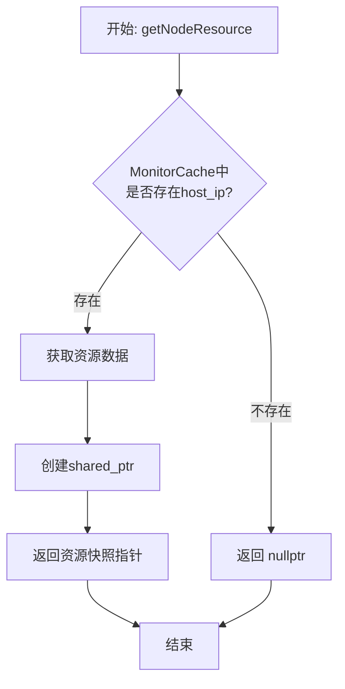

**异常**：无

#### 1.1.2 queryMetricsSeries

```cpp
virtual MetricsSeries queryMetricsSeries(
    const std::string& host_ip,
    const std::string& duration,
    const std::vector<std::string>& kinds) const = 0;
```

**功能**：查询一段时间窗口内的指标序列

**参数**：

| 参数名 | 类型 | 必填 | 描述 |
|--------|------|------|------|
| `host_ip` | `string` | 是 | 节点的IP地址 |
| `duration` | `string` | 是 | 时间窗口，支持简写：`1h`/`5m`/`10s`（仅单一单位） |
| `kinds` | `vector<string>` | 是 | 资源类型列表，可选值：`"cpu"`, `"memory"`, `"network"`, `"disk"`, `"gpu"`<br>空列表表示查询全部类型 |

**返回值**：

| 类型 | 描述 |
|------|------|
| `MetricsSeries` | 指标时间序列数据，包含以下字段 |

**MetricsSeries 字段**：

| 字段名 | 类型 | 描述 |
|--------|------|------|
| `cpu` | `vector<CpuPoint>` | CPU指标序列 |
| `memory` | `vector<MemoryPoint>` | 内存指标序列 |
| `network` | `map<string, vector<NetworkPoint>>` | 按网卡分组的网络指标 |
| `disk` | `map<string, vector<DiskPoint>>` | 按设备分组的磁盘指标 |
| `gpu` | `map<string, vector<GpuPoint>>` | 按GPU编号分组的GPU指标 |

**处理逻辑**：
1. 标准化时间窗口参数（将简写如"1h"、"5m"转换为"1 hours"、"5 minutes"）
2. 调用 ResourceRepository 从 TimescaleDB 查询指定时间窗口内的指标数据
3. 根据 kinds 参数过滤需要查询的指标类型（CPU、内存、网络、磁盘、GPU）
4. 按照资源类型分别查询各表，汇总返回时间序列数据
5. 网络、磁盘、GPU数据按设备/接口名称分组返回

**流程图**：

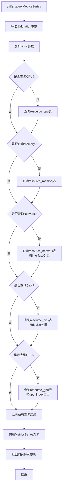

**异常**：查询失败时可能抛出数据库异常

---

### 1.2 实现类：MonitorManager

#### 1.2.1 构造函数

```cpp
MonitorManager(
    std::shared_ptr<hv::HttpService> service,
    std::shared_ptr<node::INodeModule> node_module
);
```

**参数**：

| 参数名 | 类型 | 必填 | 描述 |
|--------|------|------|------|
| `service` | `std::shared_ptr<hv::HttpService>` | 是 | HTTP服务实例，用于注册路由 |
| `node_module` | `std::shared_ptr<node::INodeModule>` | 是 | 节点管理模块实例，用于关联节点信息 |

**处理逻辑**：
1. 允许跨域请求（CORS）
2. 创建并启动组播扫描器（MulticastScanner），配置从配置文件读取
3. 初始化 ResourceRepository，连接 TimescaleDB
4. 初始化 MonitorCache 内存缓存
5. 注册 POST /resource 路由，用于接收节点上报的资源数据
   - 解析JSON请求体，提取 data 字段
   - 将资源数据写入内存缓存（MonitorCache）
   - 将资源数据持久化到 TimescaleDB

**流程图**：

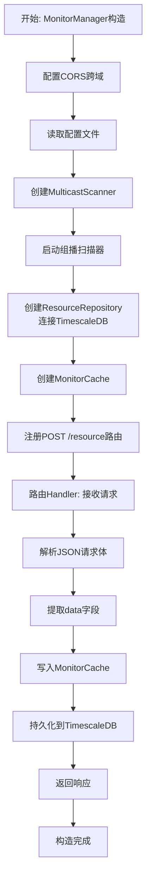

---

### 1.3 辅助类：MonitorCache

缓存最近上报的资源数据，线程安全。

#### 1.3.1 put

```cpp
void put(const Resource& res, std::int64_t timestamp_ms);
```

**功能**：写入或更新缓存

**参数**：

| 参数名 | 类型 | 必填 | 描述 |
|--------|------|------|------|
| `res` | `Resource` | 是 | 资源数据 |
| `timestamp_ms` | `int64` | 是 | 时间戳（毫秒） |

**处理逻辑**：
1. 使用互斥锁保护，确保线程安全
2. 以 host_ip 为键，存储或更新资源数据和时间戳
3. 覆盖该节点的旧数据（如果存在）

**流程图**：

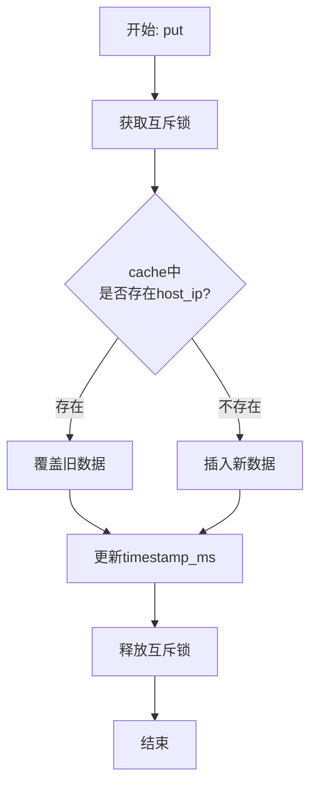

#### 1.3.2 get

```cpp
std::optional<Resource> get(const std::string& host_ip) const;
```

**功能**：根据IP读取最近一次资源数据

**参数**：

| 参数名 | 类型 | 必填 | 描述 |
|--------|------|------|------|
| `host_ip` | `string` | 是 | 节点IP地址 |

**返回值**：

| 类型 | 描述 |
|------|------|
| `std::optional<Resource>` | 存在返回资源数据，否则返回空 |

#### 1.3.3 getUpdatedAt

```cpp
std::int64_t getUpdatedAt(const std::string& host_ip) const;
```

**功能**：返回节点最近更新时间

**参数**：

| 参数名 | 类型 | 必填 | 描述 |
|--------|------|------|------|
| `host_ip` | `string` | 是 | 节点IP地址 |

**返回值**：

| 类型 | 描述 |
|------|------|
| `int64` | 更新时间（毫秒），不存在返回0 |

#### 1.3.4 getAllHosts

```cpp
std::vector<std::string> getAllHosts() const;
```

**功能**：返回当前缓存中的所有节点IP

**返回值**：

| 类型 | 描述 |
|------|------|
| `vector<string>` | 节点IP列表 |

---

### 1.4 辅助类：ResourceRepository

TimescaleDB资源存储库。

#### 1.4.1 构造函数

```cpp
explicit ResourceRepository(const std::string& conninfo);
```

**参数**：

| 参数名 | 类型 | 必填 | 描述 |
|--------|------|------|------|
| `conninfo` | `string` | 是 | PostgreSQL连接字符串 |

#### 1.4.2 save

```cpp
void save(const Resource& data);
```

**功能**：将资源数据写入TimescaleDB（多表，单事务）

**参数**：

| 参数名 | 类型 | 必填 | 描述 |
|--------|------|------|------|
| `data` | `Resource` | 是 | 资源数据 |

**处理逻辑**：
1. 创建数据库连接和事务
2. 将资源数据拆分写入多个TimescaleDB表（单事务保证原子性）：
   - `resource_alive`：节点存活心跳
   - `resource_cpu`：CPU指标数据
   - `resource_memory`：内存指标数据
   - `resource_network`：网络接口数据（遍历所有网卡）
   - `resource_disk`：磁盘分区数据（遍历所有分区）
   - `resource_gpu`：GPU数据（遍历所有GPU）
   - `component_resource`：组件资源数据（遍历所有组件）
3. 所有插入操作使用参数化查询，防止SQL注入
4. 时间戳使用数据库当前时间（now()）
5. 提交事务

**流程图**：

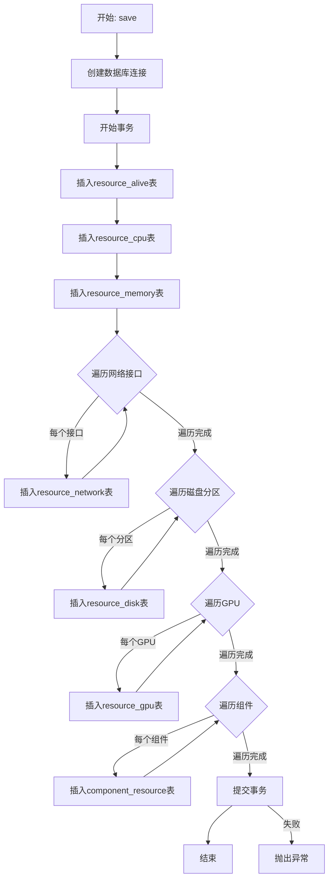

**异常**：数据库写入失败时抛出异常

#### 1.4.3 queryMetricsSeries

```cpp
MetricsSeries queryMetricsSeries(
    const std::string& host_ip,
    const std::string& duration,
    const std::vector<std::string>& kinds
);
```

**功能**：查询节点在时间窗口内的资源指标序列

**参数**：

| 参数名 | 类型 | 必填 | 描述 |
|--------|------|------|------|
| `host_ip` | `string` | 是 | 节点的IP地址 |
| `duration` | `string` | 是 | 时间窗口 |
| `kinds` | `vector<string>` | 是 | 资源类型列表 |

**返回值**：参考 [IMonitorModule::queryMetricsSeries](#112-querymetricsseries)

---

### 1.5 工厂类：MonitorFactory

```cpp
static std::shared_ptr<IMonitorModule> getMonitorModule(
    std::shared_ptr<hv::HttpService> service,
    std::shared_ptr<node::INodeModule> node_module
);
```

**功能**：创建Monitor模块实例

**参数**：

| 参数名 | 类型 | 必填 | 描述 |
|--------|------|------|------|
| `service` | `std::shared_ptr<hv::HttpService>` | 是 | HTTP服务实例 |
| `node_module` | `std::shared_ptr<node::INodeModule>` | 是 | 节点管理模块实例 |

**返回值**：

| 类型 | 描述 |
|------|------|
| `shared_ptr<IMonitorModule>` | Monitor模块接口指针 |

---

## 2. BMC 模块

### 2.1 主接口：IBMCModule

BMC（基板管理控制器）监控模块接口。

#### 2.1.1 queryBMCSensor

```cpp
virtual std::unordered_map<std::string, std::vector<BMCSensorRow>> queryBMCSensor(
    const std::string& host_ip,
    const std::string& duration
) const = 0;
```

**功能**：查询指定节点在时间窗口内的传感器数据

**参数**：

| 参数名 | 类型 | 必填 | 描述 |
|--------|------|------|------|
| `host_ip` | `string` | 是 | 节点IP地址 |
| `duration` | `string` | 是 | 时间窗口，如 `"1h"`, `"30m"`, `"60s"` |

**返回值**：

| 类型 | 描述 |
|------|------|
| `unordered_map<string, vector<BMCSensorRow>>` | 按传感器名称分组的传感器数据<br>Key: 传感器名称<br>Value: 传感器时序数据点列表 |

**处理逻辑**：
1. 调用 BMCRepository 查询TimescaleDB中的传感器数据
2. 查询指定时间窗口内的 `bmc_sensor` 表数据
3. 按传感器名称（sensorname）分组返回时序数据点
4. 每个数据点包含时间戳、传感器值、告警类型等信息

#### 2.1.2 getBoxBMC

```cpp
virtual std::optional<UdpInfo> getBoxBMC(int box_id) const = 0;
```

**功能**：获取指定机柜的最新BMC数据

**参数**：

| 参数名 | 类型 | 必填 | 描述 |
|--------|------|------|------|
| `box_id` | `int` | 是 | 机柜ID |

**返回值**：

| 类型 | 描述 |
|------|------|
| `std::optional<UdpInfo>` | 存在返回BMC数据包，否则返回空 |

#### 2.1.3 getAllBoxBMC

```cpp
virtual std::vector<UdpInfo> getAllBoxBMC() const = 0;
```

**功能**：返回所有机柜的最新BMC数据

**返回值**：

| 类型 | 描述 |
|------|------|
| `vector<UdpInfo>` | 所有机柜的BMC数据包列表 |

---

### 2.2 实现类：BMCListener

监听UDP组播的BMC数据包。

#### 2.2.1 构造函数

```cpp
BMCListener(
    const std::string& listen_ip,
    const std::string& mcast_group = "224.100.200.15",
    std::uint16_t mcast_port = 5715,
    const std::string& conninfo = ""
);
```

**参数**：

| 参数名 | 类型 | 必填 | 默认值 | 描述 |
|--------|------|------|--------|------|
| `listen_ip` | `string` | 是 | - | 监听IP地址 |
| `mcast_group` | `string` | 否 | `"224.100.200.15"` | 组播组地址 |
| `mcast_port` | `uint16` | 否 | `5715` | 组播端口 |
| `conninfo` | `string` | 否 | `""` | 数据库连接字符串（可选） |

**处理逻辑**：
1. 保存监听配置参数（IP、组播组、端口）
2. 如果提供了数据库连接字符串，创建 BMCRepository 实例
3. 创建 BMCCache 实例用于缓存最新的BMC数据

**流程图**：

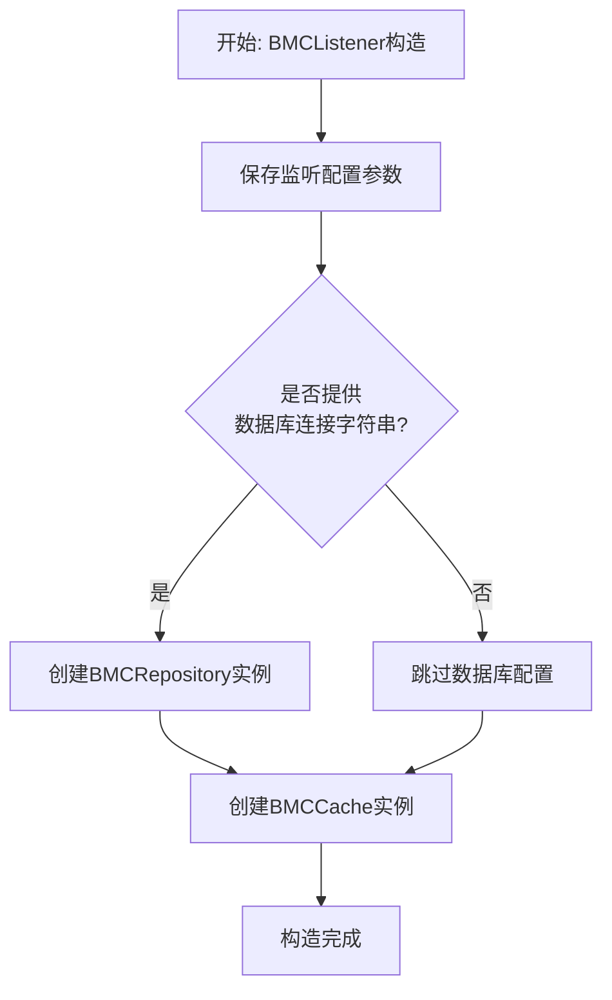

#### 2.2.2 start/stop

```cpp
void start();
void stop();
```

**功能**：启动/停止UDP监听线程

**start 处理逻辑**：
1. 检查是否已经在运行，避免重复启动
2. 创建UDP套接字并配置选项（SO_REUSEADDR）
3. 绑定到指定端口（INADDR_ANY）
4. 设置接收超时（1秒），避免停止时长期阻塞
5. 加入组播组（IP_ADD_MEMBERSHIP）
6. 启动独立线程接收UDP数据包
7. 循环接收数据，每收到一个包：
   - 验证包大小和结构
   - 解析为 UdpInfo 结构
   - 更新到 BMCCache
   - 如果设置了 repository，持久化到数据库
   - 如果设置了 handler 回调，调用回调函数

**start 流程图**：

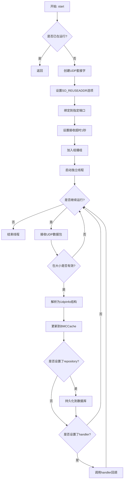

**stop 处理逻辑**：
1. 设置运行标志为false
2. 关闭UDP套接字，唤醒阻塞的 recvfrom
3. 等待接收线程退出

**stop 流程图**：

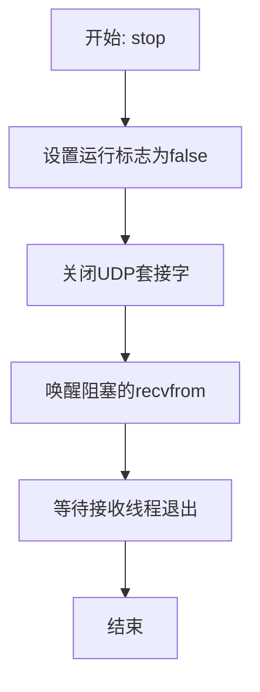

#### 2.2.3 setHandler

```cpp
void setHandler(PacketHandler handler);
```

**功能**：设置数据包处理回调

**参数**：

| 参数名 | 类型 | 必填 | 描述 |
|--------|------|------|------|
| `handler` | `function<void(const UdpInfo&)>` | 是 | 数据包处理函数 |

#### 2.2.4 setRepository

```cpp
void setRepository(std::unique_ptr<BMCRepository> repo);
```

**功能**：设置数据持久化仓库

**参数**：

| 参数名 | 类型 | 必填 | 描述 |
|--------|------|------|------|
| `repo` | `unique_ptr<BMCRepository>` | 是 | 仓库实例 |

---

### 2.3 辅助类：BMCCache

缓存各机柜的最新BMC数据，线程安全。

#### 2.3.1 addOrUpdate

```cpp
bool addOrUpdate(const UdpInfo& info);
```

**功能**：新增或更新指定机柜的BMC数据

**参数**：

| 参数名 | 类型 | 必填 | 描述 |
|--------|------|------|------|
| `info` | `UdpInfo` | 是 | BMC数据包 |

**返回值**：

| 类型 | 描述 |
|------|------|
| `bool` | 成功返回true |

**处理逻辑**：
1. 使用互斥锁保护，确保线程安全
2. 从 UdpInfo 中提取 boxid
3. 以 boxid 为键，存储BMC数据和当前时间戳
4. 如果该机柜ID已存在，覆盖旧数据

**流程图**：

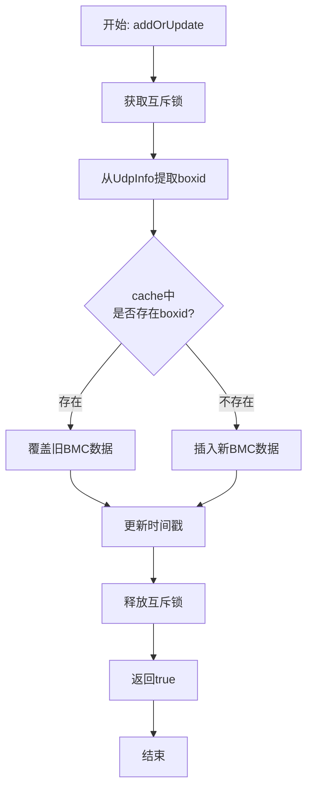

#### 2.3.2 getByBoxId

```cpp
std::optional<UdpInfo> getByBoxId(int box_id) const;
```

**功能**：根据机柜ID获取最近一次BMC数据

**参数**：

| 参数名 | 类型 | 必填 | 描述 |
|--------|------|------|------|
| `box_id` | `int` | 是 | 机柜ID |

**返回值**：

| 类型 | 描述 |
|------|------|
| `std::optional<UdpInfo>` | 存在返回数据，否则返回空 |

#### 2.3.3 getAll

```cpp
std::vector<UdpInfo> getAll() const;
```

**功能**：获取全部机柜的BMC数据（拷贝）

**返回值**：

| 类型 | 描述 |
|------|------|
| `vector<UdpInfo>` | 所有BMC数据包列表 |

---

### 2.4 辅助类：BMCRepository

BMC数据持久化到TimescaleDB。

#### 2.4.1 构造函数

```cpp
explicit BMCRepository(const std::string& conninfo);
```

**参数**：

| 参数名 | 类型 | 必填 | 描述 |
|--------|------|------|------|
| `conninfo` | `string` | 是 | PostgreSQL连接字符串 |

#### 2.4.2 save

```cpp
void save(const UdpInfo& pkt);
```

**功能**：将BMC数据包写入数据库（bmc_fan / bmc_sensor表）

**参数**：

| 参数名 | 类型 | 必填 | 描述 |
|--------|------|------|------|
| `pkt` | `UdpInfo` | 是 | BMC数据包 |

**处理逻辑**：
1. 创建数据库连接和事务
2. 解析 UdpInfo 数据包结构：
   - 遍历风扇数据（fan[2]），写入 `bmc_fan` 表
   - 遍历板卡数据（board[14]），对每块板卡：
     - 遍历其传感器数据（sensor[5]）
     - 将传感器数据写入 `bmc_sensor` 表
3. 计算完整传感器值：sensor_value = sensorvalue_H + sensorvalue_L × 0.01
4. 使用参数化查询防止SQL注入
5. 提交事务

**流程图**：

```mermaid
graph TD
    A[开始: save] --> B[创建数据库连接]
    B --> C[开始事务]
    C --> D{遍历风扇数据fan[2]}
    D -->|每个风扇| E[插入bmc_fan表]
    E --> D
    D -->|遍历完成| F{遍历板卡board[14]}
    F -->|每块板卡| G{遍历传感器sensor[5]}
    G -->|每个传感器| H[计算sensor_value<br/>= H + L × 0.01]
    H --> I[插入bmc_sensor表]
    I --> G
    G -->|遍历完成| F
    F -->|遍历完成| J[提交事务]
    J --> K[结束]
    J -->|失败| L[抛出异常]
```

#### 2.4.3 queryBMCSensor

```cpp
std::unordered_map<std::string, std::vector<BMCSensorRow>> queryBMCSensor(
    const std::string& host_ip,
    const std::string& duration
);
```

**功能**：查询指定节点的传感器时序数据

**参数**：参考 [IBMCModule::queryBMCSensor](#211-querybmcsensor)

**返回值**：参考 [IBMCModule::queryBMCSensor](#211-querybmcsensor)

---

### 2.5 工厂类：BMCFactory

```cpp
static std::shared_ptr<IBMCModule> getBMCModule();
```

**功能**：创建BMC模块实例

**返回值**：

| 类型 | 描述 |
|------|------|
| `shared_ptr<IBMCModule>` | BMC模块接口指针 |

---

## 3. Alert 模块

### 3.1 主接口：IAlertModule

告警管理模块核心接口。

#### 3.1.1 规则管理

##### listRules

```cpp
virtual std::vector<Rule> listRules() const = 0;
```

**功能**：列出所有告警规则

**返回值**：

| 类型 | 描述 |
|------|------|
| `vector<Rule>` | 规则列表 |

**处理逻辑**：
1. 调用 IRuleRepository 从数据库查询所有告警规则
2. 返回规则列表（包括已启用和未启用的）

**流程图**：

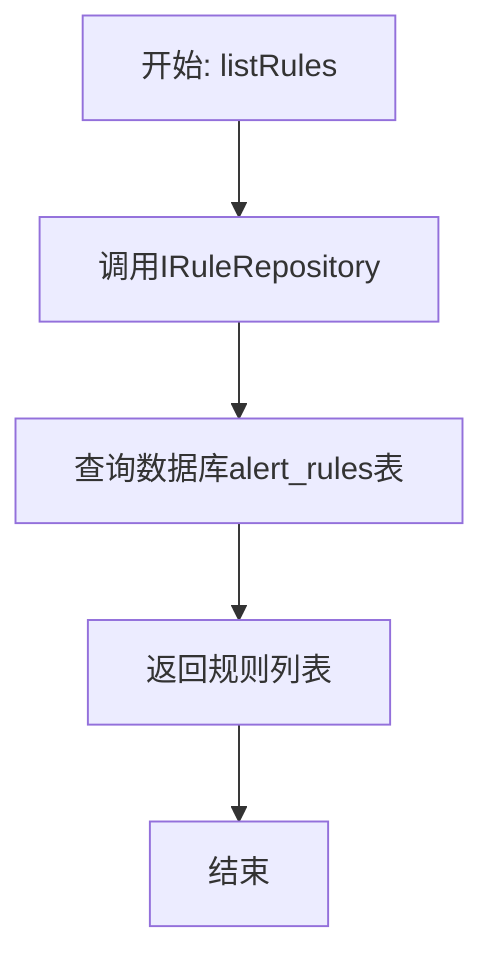

##### getRule

```cpp
virtual std::optional<Rule> getRule(const std::string& id) const = 0;
```

**功能**：根据ID获取单个规则

**参数**：

| 参数名 | 类型 | 必填 | 描述 |
|--------|------|------|------|
| `id` | `string` | 是 | 规则ID |

**返回值**：

| 类型 | 描述 |
|------|------|
| `std::optional<Rule>` | 存在返回规则，否则返回空 |

##### upsertRule

```cpp
virtual bool upsertRule(const Rule& rule) = 0;
```

**功能**：创建或更新规则

**参数**：

| 参数名 | 类型 | 必填 | 描述 |
|--------|------|------|------|
| `rule` | `Rule` | 是 | 规则对象 |

**返回值**：

| 类型 | 描述 |
|------|------|
| `bool` | 成功返回true |

**处理逻辑**：
1. 从调度器中注销该规则对应的定时任务（如果存在）
2. 调用 IRuleRepository 将规则写入或更新到数据库
3. 如果规则已启用（enabled=true）：
   - 解析评估间隔（eval_every），转换为毫秒
   - 注册定时任务到调度器
   - 任务内容：定期评估规则、生成告警事件、分发事件、调用推送回调
4. 返回操作结果

**流程图**：

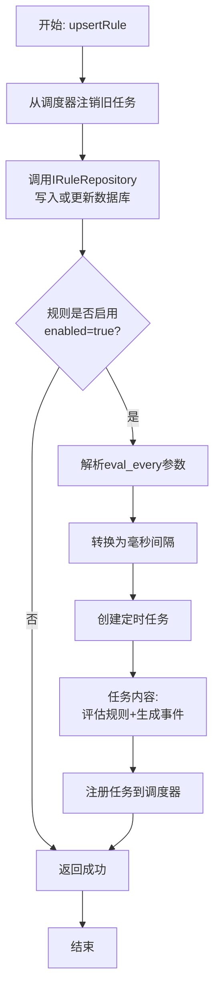

##### deleteRule

```cpp
virtual bool deleteRule(const std::string& id) = 0;
```

**功能**：删除规则

**参数**：

| 参数名 | 类型 | 必填 | 描述 |
|--------|------|------|------|
| `id` | `string` | 是 | 规则ID |

**返回值**：

| 类型 | 描述 |
|------|------|
| `bool` | 成功返回true |

#### 3.1.2 告警查询与操作

##### queryEvents

```cpp
virtual std::vector<AlertEvent> queryEvents(const std::string& duration) const = 0;
```

**功能**：查询最近一段时间的告警事件

**参数**：

| 参数名 | 类型 | 必填 | 描述 |
|--------|------|------|------|
| `duration` | `string` | 是 | 时间窗口，如 `"1h"`, `"24h"` |

**返回值**：

| 类型 | 描述 |
|------|------|
| `vector<AlertEvent>` | 告警事件列表 |

**处理逻辑**：
1. 调用 IEventRepository 查询数据库
2. 解析时间窗口参数（如"1h"、"24h"）
3. 查询 TimescaleDB 中 `alert_events` 表
4. 筛选指定时间范围内的事件
5. 按时间倒序返回事件列表

**流程图**：

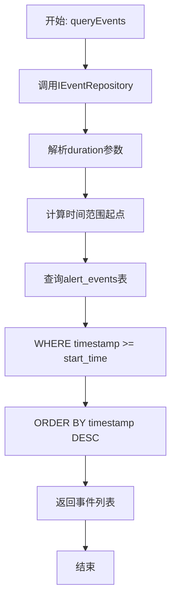

##### countEventsByStatus

```cpp
virtual std::size_t countEventsByStatus(AlertStatus status) const = 0;
```

**功能**：统计指定状态的事件总量（全量，不限时间）

**参数**：

| 参数名 | 类型 | 必填 | 描述 |
|--------|------|------|------|
| `status` | `AlertStatus` | 是 | 告警状态：`Inactive`(未激活), `Pending`(待触发), `Firing`(告警中), `Resolved`(已恢复) |

**返回值**：

| 类型 | 描述 |
|------|------|
| `size_t` | 事件数量 |

##### appendAlertEvent

```cpp
virtual bool appendAlertEvent(const AlertEvent& event) = 0;
```

**功能**：手动追加告警事件

**参数**：

| 参数名 | 类型 | 必填 | 描述 |
|--------|------|------|------|
| `event` | `AlertEvent` | 是 | 告警事件对象 |

**返回值**：

| 类型 | 描述 |
|------|------|
| `bool` | 成功返回true |

##### ackAlert

```cpp
virtual bool ackAlert(
    const std::string& fingerprint,
    const std::string& user,
    const std::string& comment
) = 0;
```

**功能**：确认告警

**参数**：

| 参数名 | 类型 | 必填 | 描述 |
|--------|------|------|------|
| `fingerprint` | `string` | 是 | 告警指纹（唯一标识） |
| `user` | `string` | 是 | 确认用户 |
| `comment` | `string` | 是 | 确认备注 |

**返回值**：

| 类型 | 描述 |
|------|------|
| `bool` | 成功返回true |

##### setPushCallback

```cpp
virtual void setPushCallback(std::function<void(const AlertEvent&)> cb) = 0;
```

**功能**：设置外部推送回调（由Web层提供）

**参数**：

| 参数名 | 类型 | 必填 | 描述 |
|--------|------|------|------|
| `cb` | `function<void(const AlertEvent&)>` | 是 | 推送回调函数 |

---

### 3.2 实现类：AlertManager

#### 3.2.1 构造函数

```cpp
AlertManager();
```

**功能**：初始化告警管理器，创建所有内部服务组件

**处理逻辑**：
1. 创建数据库连接（从配置文件读取连接字符串）
2. 初始化所有内部服务组件：
   - DatabaseRuleRepository：规则存储（PostgreSQL）
   - MemoryAlertRepository：告警状态存储（内存）
   - DatabaseEventRepository：事件存储（TimescaleDB）
   - SimpleFingerprintGenerator：指纹生成器
   - SimpleTimeseriesProvider：时序数据提供者
   - BasicAlertEvaluator：告警评估器
   - BasicAlertStateManager：告警状态管理器
   - BasicScheduler：任务调度器
3. 启动调度器
4. 遍历所有已启用的规则，为每个规则注册定时评估任务：
   - 解析规则的评估间隔（eval_every）
   - 创建定时任务：评估规则 → 应用状态变更 → 生成事件 → 分发事件
   - 注册任务到调度器

**流程图**：

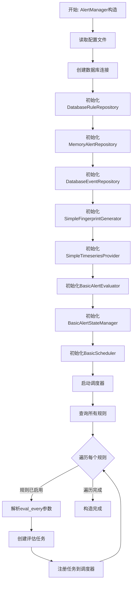

#### 3.2.2 dispatcher

```cpp
EventDispatcher& dispatcher();
```

**功能**：获取事件调度器，用于订阅告警事件

**返回值**：

| 类型 | 描述 |
|------|------|
| `EventDispatcher&` | 事件调度器引用 |

---

### 3.3 内部服务接口

Alert模块采用服务分层架构，以下是各服务接口。

#### 3.3.1 ITimeseriesProvider

时序数据提供者接口。

```cpp
virtual nlohmann::json evaluate(
    const std::string& expression,
    const LabelSet& selector,
    const std::string& window
) = 0;
```

**功能**：执行表达式（SQL/DSL），返回时序数据查询结果

**参数**：

| 参数名 | 类型 | 必填 | 描述 |
|--------|------|------|------|
| `expression` | `string` | 是 | 查询表达式（SQL语句） |
| `selector` | `LabelSet` | 是 | 标签选择器（键值对映射） |
| `window` | `string` | 是 | 时间窗口 |

**返回值**：

| 类型 | 描述 |
|------|------|
| `json` | 查询结果的JSON表示 |

#### 3.3.2 IRuleRepository

规则存储接口。

```cpp
virtual std::vector<Rule> listRules() const = 0;
virtual std::optional<Rule> getRule(const std::string& id) const = 0;
virtual bool upsertRule(const Rule& rule) = 0;
virtual bool deleteRule(const std::string& id) = 0;
```

**功能**：规则的CRUD操作

#### 3.3.3 IAlertRepository

告警状态存储接口。

```cpp
virtual std::optional<AlertState> getState(const std::string& fingerprint) const = 0;
virtual bool upsertState(const AlertState& state) = 0;
virtual std::vector<AlertState> listActive(const LabelSet& matcher) const = 0;
```

**功能**：告警状态的存储和查询

**getState 参数**：

| 参数名 | 类型 | 必填 | 描述 |
|--------|------|------|------|
| `fingerprint` | `string` | 是 | 告警指纹 |

**upsertState 参数**：

| 参数名 | 类型 | 必填 | 描述 |
|--------|------|------|------|
| `state` | `AlertState` | 是 | 告警状态对象 |

**listActive 参数**：

| 参数名 | 类型 | 必填 | 描述 |
|--------|------|------|------|
| `matcher` | `LabelSet` | 是 | 标签匹配器 |

#### 3.3.4 IEventRepository

告警事件存储接口。

```cpp
virtual bool append(const AlertEvent& event) = 0;
virtual std::vector<AlertEvent> query(const std::string& duration) const = 0;
virtual std::size_t countByStatus(AlertStatus status) const = 0;
```

**功能**：告警事件的追加、查询和统计

#### 3.3.5 IFingerprintGenerator

指纹生成器接口。

```cpp
virtual std::string generate(
    const std::string& rule_id,
    const LabelSet& labels
) const = 0;
```

**功能**：根据规则ID和标签生成唯一指纹

**参数**：

| 参数名 | 类型 | 必填 | 描述 |
|--------|------|------|------|
| `rule_id` | `string` | 是 | 规则ID |
| `labels` | `LabelSet` | 是 | 标签集合 |

**返回值**：

| 类型 | 描述 |
|------|------|
| `string` | 告警指纹字符串 |

#### 3.3.6 IAlertEvaluator

告警评估器接口。

```cpp
virtual std::vector<EvaluationPoint> evaluate(
    const Rule& rule,
    std::int64_t now_ms
) = 0;
```

**功能**：评估规则，返回评估点

**参数**：

| 参数名 | 类型 | 必填 | 描述 |
|--------|------|------|------|
| `rule` | `Rule` | 是 | 告警规则 |
| `now_ms` | `int64` | 是 | 当前时间戳（毫秒） |

**返回值**：

| 类型 | 描述 |
|------|------|
| `vector<EvaluationPoint>` | 评估点列表，包含实例标签、是否命中、判定值、上下文信息 |

**处理逻辑**：
1. 调用 ITimeseriesProvider 执行规则中的表达式（SQL查询）
2. 根据规则的 selector（标签选择器）过滤目标实例
3. 在指定的时间窗口（window）内查询时序数据
4. 对每个实例的数据应用规则条件判断（如 CPU > 80%）
5. 生成评估点列表：
   - labels：实例标签（如 host_ip）
   - matched：是否满足告警条件
   - value：当前指标值
   - context：上下文信息（用于告警描述）

**流程图**：

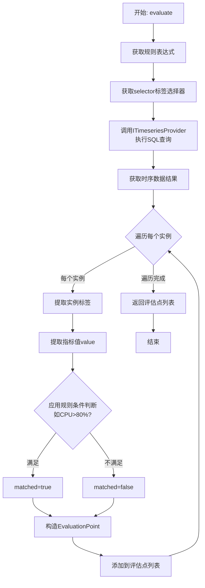

#### 3.3.7 IAlertStateManager

告警状态管理器接口。

```cpp
virtual std::vector<AlertEvent> apply(
    const Rule& rule,
    const std::vector<EvaluationPoint>& points,
    std::int64_t now_ms
) = 0;

virtual std::vector<AlertState> listActive(const LabelSet& matcher) const = 0;

virtual bool ack(
    const std::string& fingerprint,
    const std::string& user,
    const std::string& comment
) = 0;
```

**功能**：应用评估结果、查询活跃告警、确认告警

**apply 参数**：

| 参数名 | 类型 | 必填 | 描述 |
|--------|------|------|------|
| `rule` | `Rule` | 是 | 告警规则 |
| `points` | `vector<EvaluationPoint>` | 是 | 评估点列表 |
| `now_ms` | `int64` | 是 | 当前时间戳（毫秒） |

**listActive 参数**：

| 参数名 | 类型 | 必填 | 描述 |
|--------|------|------|------|
| `matcher` | `LabelSet` | 是 | 标签匹配器 |

**ack 参数**：

| 参数名 | 类型 | 必填 | 描述 |
|--------|------|------|------|
| `fingerprint` | `string` | 是 | 告警指纹 |
| `user` | `string` | 是 | 确认用户 |
| `comment` | `string` | 是 | 确认备注 |

**apply 处理逻辑**：
1. 遍历所有评估点
2. 为每个实例生成告警指纹（rule_id + labels）
3. 从 IAlertRepository 获取该指纹对应的告警状态
4. 根据评估结果和历史状态，应用状态转换：
   - Inactive → Pending：首次命中
   - Pending → Firing：连续命中达到 for_times 次数
   - Firing → Resolved：条件不再满足
5. 对于状态变更，生成 AlertEvent 事件
6. 更新告警状态到 IAlertRepository
7. 将事件追加到 IEventRepository
8. 返回新生成的事件列表

**流程图**：

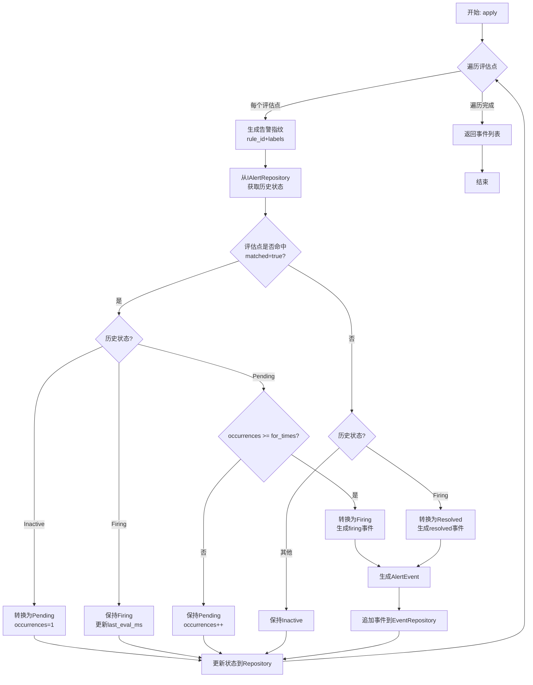

#### 3.3.8 IScheduler

任务调度器接口。

```cpp
using Task = std::function<void()>;

virtual void start() = 0;
virtual void stop() = 0;
virtual void registerTask(
    const std::string& id,
    std::int64_t interval_ms,
    Task task
) = 0;
virtual void unregisterTask(const std::string& id) = 0;
```

**功能**：启动/停止调度器，注册/注销定时任务

**registerTask 参数**：

| 参数名 | 类型 | 必填 | 描述 |
|--------|------|------|------|
| `id` | `string` | 是 | 任务ID |
| `interval_ms` | `int64` | 是 | 执行间隔（毫秒） |
| `task` | `function<void()>` | 是 | 任务函数 |

**unregisterTask 参数**：

| 参数名 | 类型 | 必填 | 描述 |
|--------|------|------|------|
| `id` | `string` | 是 | 任务ID |

**registerTask 处理逻辑**：
1. 创建任务条目，记录任务ID、执行间隔、任务函数
2. 计算下次执行时间（当前时间 + 间隔）
3. 将任务注册到调度器的任务队列
4. 调度器在独立线程中循环检查任务：
   - 当前时间 >= 下次执行时间时，执行任务
   - 执行完成后更新下次执行时间

**registerTask 流程图**：

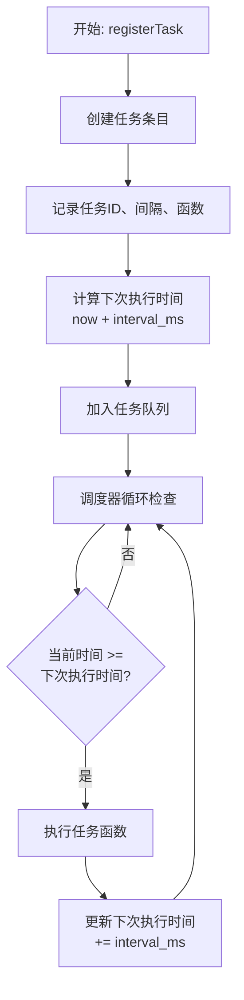

**unregisterTask 处理逻辑**：
1. 从调度器的任务队列中移除指定ID的任务
2. 该任务不再被调度执行

**unregisterTask 流程图**：

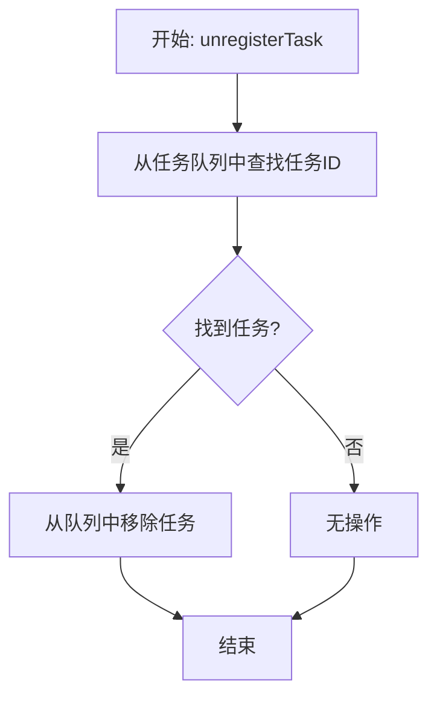

---

### 3.4 实现类

#### 3.4.1 DatabaseEventRepository

数据库事件仓库实现（TimescaleDB）。

```cpp
explicit DatabaseEventRepository(std::shared_ptr<pqxx::connection> conn);

bool append(const AlertEvent& event) override;
std::vector<AlertEvent> query(const std::string& duration) const override;
std::size_t countByStatus(AlertStatus status) const override;
```

#### 3.4.2 DatabaseRuleRepository

数据库规则仓库实现（PostgreSQL）。

```cpp
explicit DatabaseRuleRepository(std::shared_ptr<pqxx::connection> conn);

std::vector<Rule> listRules() const override;
std::optional<Rule> getRule(const std::string& id) const override;
bool upsertRule(const Rule& rule) override;
bool deleteRule(const std::string& id) override;
```

---

### 3.5 工厂类：AlertFactory

```cpp
static std::shared_ptr<IAlertModule> getAlertModule();
```

**功能**：创建Alert模块实例

**返回值**：

| 类型 | 描述 |
|------|------|
| `shared_ptr<IAlertModule>` | Alert模块接口指针 |

---

## 4. Node 模块

### 4.1 主接口：INodeModule

节点管理模块接口。

#### 4.1.1 getAllNodes

```cpp
virtual std::vector<NodeExt> getAllNodes() const = 0;
```

**功能**：获取所有节点（含元数据）

**返回值**：

| 类型 | 描述 |
|------|------|
| `vector<NodeExt>` | 节点扩展信息列表，包含节点基础信息、更新时间、状态等 |

**处理逻辑**：
1. 从 NodeCache 获取所有节点数据
2. 获取当前时间戳（毫秒）
3. 遍历所有节点，计算每个节点的在线状态：
   - 如果最后更新时间在10秒内，状态为"online"
   - 否则状态为"offline"
4. 返回包含状态信息的节点列表

**流程图**：

```mermaid
graph TD
    A[开始: getAllNodes] --> B[从NodeCache获取所有节点]
    B --> C[获取当前时间戳now_ms]
    C --> D{遍历每个节点}
    D -->|每个节点| E[获取节点updated_at]
    E --> F{now_ms - updated_at<br/> <= 10000ms?}
    F -->|是| G[设置status="online"]
    F -->|否| H[设置status="offline"]
    G --> I[添加到结果列表]
    H --> I
    I --> D
    D -->|遍历完成| J[返回节点列表]
    J --> K[结束]
```

#### 4.1.2 getNodeByIP

```cpp
virtual std::optional<NodeExt> getNodeByIP(const std::string& ip) const = 0;
```

**功能**：根据IP获取单个节点（含元数据）

**参数**：

| 参数名 | 类型 | 必填 | 描述 |
|--------|------|------|------|
| `ip` | `string` | 是 | 节点IP地址 |

**返回值**：

| 类型 | 描述 |
|------|------|
| `std::optional<NodeExt>` | 存在返回节点信息，否则返回空 |

---

### 4.2 实现类：NodeManager

#### 4.2.1 构造函数

```cpp
explicit NodeManager(std::shared_ptr<hv::HttpService> service);
```

**参数**：

| 参数名 | 类型 | 必填 | 描述 |
|--------|------|------|------|
| `service` | `std::shared_ptr<hv::HttpService>` | 是 | HTTP服务实例（通过依赖注入） |

**功能**：初始化节点管理器，设置路由和缓存

**处理逻辑**：
1. 创建 NodeCache 实例用于缓存节点数据
2. 允许跨域请求（CORS）
3. 创建并启动组播扫描器（MulticastScanner），配置从配置文件读取
4. 注册 POST /heartbeat 路由，用于接收节点心跳：
   - 解析JSON请求体，提取 data 字段
   - 将节点信息更新到 NodeCache
   - 自动记录更新时间戳
   - 返回 200 状态码

**流程图**：

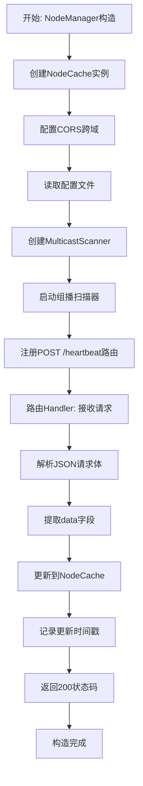

---

### 4.3 辅助类：NodeCache

节点缓存类，线程安全。

#### 4.3.1 addOrUpdateNode

```cpp
bool addOrUpdateNode(const Node& node);
```

**功能**：添加或更新节点

**参数**：

| 参数名 | 类型 | 必填 | 描述 |
|--------|------|------|------|
| `node` | `Node` | 是 | 节点信息 |

**返回值**：

| 类型 | 描述 |
|------|------|
| `bool` | 成功返回true，失败返回false（如IP为空） |

**处理逻辑**：
1. 使用互斥锁保护，确保线程安全
2. 验证节点IP地址是否为空
3. 以 host_ip 为键，存储节点数据和当前时间戳
4. 如果该IP已存在，覆盖旧数据

**流程图**：

```mermaid
graph TD
    A[开始: addOrUpdateNode] --> B{验证host_ip<br/>是否为空?}
    B -->|是空| C[返回false]
    B -->|不为空| D[获取互斥锁]
    D --> E{cache中<br/>是否存在host_ip?}
    E -->|存在| F[覆盖旧节点数据]
    E -->|不存在| G[插入新节点数据]
    F --> H[更新时间戳为当前时间]
    G --> H
    H --> I[释放互斥锁]
    I --> J[返回true]
    J --> K[结束]
    C --> K
```

#### 4.3.2 getNode

```cpp
std::optional<NodeExt> getNode(const std::string& ip) const;
```

**功能**：根据IP地址获取节点

**参数**：

| 参数名 | 类型 | 必填 | 描述 |
|--------|------|------|------|
| `ip` | `string` | 是 | IP地址 |

**返回值**：

| 类型 | 描述 |
|------|------|
| `std::optional<NodeExt>` | 存在返回节点信息，不存在返回空 |

#### 4.3.3 getAllNodes

```cpp
std::vector<NodeExt> getAllNodes() const;
```

**功能**：获取所有节点

**返回值**：

| 类型 | 描述 |
|------|------|
| `vector<NodeExt>` | 所有节点的副本 |

---

### 4.4 工厂类：NodeFactory

```cpp
static std::shared_ptr<INodeModule> getNodeModule(
    std::shared_ptr<hv::HttpService> service
);
```

**功能**：创建节点管理模块

**参数**：

| 参数名 | 类型 | 必填 | 描述 |
|--------|------|------|------|
| `service` | `std::shared_ptr<hv::HttpService>` | 是 | HTTP服务器实例 |

**返回值**：

| 类型 | 描述 |
|------|------|
| `shared_ptr<INodeModule>` | 节点管理模块智能指针 |

---

## 5. 公共数据模型

### 5.1 Monitor 模块数据模型

#### 5.1.1 Resource

完整的资源快照。

| 字段名 | 类型 | 描述 |
|--------|------|------|
| `host_ip` | `string` | 节点IP |
| `resource` | `NodeResource` | 节点资源 |
| `component` | `vector<ComponentEntry>` | 组件列表 |

#### 5.1.2 NodeResource

节点级资源数据。

| 字段名 | 类型 | 描述 |
|--------|------|------|
| `cpu` | `CpuResource` | CPU资源 |
| `memory` | `MemoryResource` | 内存资源 |
| `network` | `vector<NetworkInterface>` | 网络接口列表 |
| `disk` | `vector<DiskPartition>` | 磁盘分区列表 |
| `gpu` | `vector<GpuResource>` | GPU列表 |
| `gpu_allocated` | `int` | 已分配GPU数 |
| `gpu_num` | `int` | GPU总数 |

#### 5.1.3 CpuResource

CPU资源详情。

| 字段名 | 类型 | 描述 |
|--------|------|------|
| `usage_percent` | `double` | 使用率（百分比） |
| `load_avg_1m` | `double` | 1分钟平均负载 |
| `load_avg_5m` | `double` | 5分钟平均负载 |
| `load_avg_15m` | `double` | 15分钟平均负载 |
| `core_count` | `int` | 核心总数 |
| `core_allocated` | `int` | 已分配核心数 |
| `temperature` | `double` | 温度（℃） |
| `voltage` | `double` | 电压（V） |
| `current` | `double` | 电流（A） |
| `power` | `double` | 功率（W） |

#### 5.1.4 MemoryResource

内存资源详情。

| 字段名 | 类型 | 描述 |
|--------|------|------|
| `total` | `uint64` | 总容量（字节） |
| `used` | `uint64` | 已使用（字节） |
| `free` | `uint64` | 空闲（字节） |
| `usage_percent` | `double` | 使用率（百分比） |

#### 5.1.5 NetworkInterface

网络接口信息。

| 字段名 | 类型 | 描述 |
|--------|------|------|
| `interface` | `string` | 接口名称 |
| `rx_bytes` | `uint64` | 接收字节数 |
| `tx_bytes` | `uint64` | 发送字节数 |
| `rx_packets` | `uint64` | 接收包数 |
| `tx_packets` | `uint64` | 发送包数 |
| `rx_errors` | `uint64` | 接收错误数 |
| `tx_errors` | `uint64` | 发送错误数 |
| `rx_rate` | `uint64` | 接收速率（字节/秒） |
| `tx_rate` | `uint64` | 发送速率（字节/秒） |

#### 5.1.6 DiskPartition

磁盘分区信息。

| 字段名 | 类型 | 描述 |
|--------|------|------|
| `device` | `string` | 设备名 |
| `mount_point` | `string` | 挂载点 |
| `total` | `uint64` | 总容量（字节） |
| `used` | `uint64` | 已使用（字节） |
| `free` | `uint64` | 空闲（字节） |
| `usage_percent` | `double` | 使用率（百分比） |

#### 5.1.7 GpuResource

GPU资源信息。

| 字段名 | 类型 | 描述 |
|--------|------|------|
| `index` | `int` | GPU索引 |
| `name` | `string` | GPU名称 |
| `compute_usage` | `double` | 计算使用率（百分比） |
| `mem_usage` | `double` | 显存使用率（百分比） |
| `mem_used` | `uint64` | 已使用显存（字节） |
| `mem_total` | `uint64` | 显存总量（字节） |
| `temperature` | `double` | 温度（℃） |
| `power` | `double` | 功率（W） |

#### 5.1.8 ComponentEntry

组件实例信息。

| 字段名 | 类型 | 描述 |
|--------|------|------|
| `instance_id` | `string` | 实例ID |
| `uuid` | `string` | UUID |
| `index` | `int` | 索引 |
| `config` | `ComponentConfig` | 配置 |
| `state` | `string` | 状态 |
| `resource` | `ComponentResource` | 资源使用 |

#### 5.1.9 MetricsSeries

指标时间序列。

| 字段名 | 类型 | 描述 |
|--------|------|------|
| `cpu` | `vector<CpuPoint>` | CPU指标序列 |
| `memory` | `vector<MemoryPoint>` | 内存指标序列 |
| `disk` | `map<string, vector<DiskPoint>>` | 磁盘指标序列，按设备名分组 |
| `gpu` | `map<string, vector<GpuPoint>>` | GPU指标序列，按GPU索引分组 |
| `network` | `map<string, vector<NetworkPoint>>` | 网络指标序列，按网卡名分组 |

**说明**：每个 Point 类型都包含 `timestamp` 字段（毫秒时间戳）和对应资源的各项指标。

---

### 5.2 BMC 模块数据模型

#### 5.2.1 UdpInfo

BMC UDP数据包结构（1096字节，packed）。

| 字段名 | 类型 | 描述 |
|--------|------|------|
| `head` | `uint16` | 包头标识 |
| `msglenth` | `uint16` | 消息长度 |
| `seqnum` | `uint16` | 序列号 |
| `msgtype` | `uint16` | 消息类型 |
| `timestamp` | `uint32` | 时间戳 |
| `recv[4]` | `uint8[4]` | 保留字段 |
| `boxname` | `uint8` | 机柜名称 |
| `boxid` | `uint8` | 机柜ID |
| `fan[2]` | `UdpFanInfo[2]` | 风扇信息（2个） |
| `board[14]` | `UdpBoardInfo[14]` | 板卡信息（14个） |
| `tail` | `uint16` | 包尾标识 |

#### 5.2.2 UdpFanInfo

风扇信息（6字节）。

| 字段名 | 类型 | 描述 |
|--------|------|------|
| `fanseq` | `uint8` | 风扇序号 |
| `fanmode` | `uint8` | 风扇模式 |
| `fanspeed` | `uint32` | 风扇转速 |

#### 5.2.3 UdpBoardInfo

板卡信息（76字节）。

| 字段名 | 类型 | 描述 |
|--------|------|------|
| `ipmbaddr` | `uint8` | IPMB地址 |
| `moduletype` | `uint16` | 模块类型 |
| `bmccompany` | `uint16` | BMC厂商 |
| `bmcversion[8]` | `uint8[8]` | BMC版本 |
| `sensornum` | `uint8` | 传感器数量 |
| `sensor[5]` | `UdpSensorInfo[5]` | 传感器信息（最多5个） |
| `resv[2]` | `uint8[2]` | 保留 |

#### 5.2.4 UdpSensorInfo

传感器信息（12字节）。

| 字段名 | 类型 | 描述 |
|--------|------|------|
| `sensorseq` | `uint8` | 传感器序号 |
| `sensortype` | `uint8` | 传感器类型 |
| `sensorname[6]` | `uint8[6]` | 传感器名称 |
| `sensorvalue_L` | `uint8` | 传感器值（小数部分） |
| `sensorvalue_H` | `uint8` | 传感器值（整数部分） |
| `sensoralmtype` | `uint8` | 告警类型 |
| `sensorresv` | `uint8` | 保留 |

#### 5.2.5 BMCSensorRow

传感器时序数据行。

| 字段名 | 类型 | 描述 |
|--------|------|------|
| `timestamp` | `int64` | 时间戳（毫秒） |
| `host_ip` | `string` | 节点IP |
| `sensorseq` | `uint16` | 传感器序号 |
| `sensortype` | `uint16` | 传感器类型 |
| `sensorname` | `string` | 传感器名称 |
| `sensorvalue_L` | `uint16` | 小数部分 |
| `sensorvalue_H` | `uint16` | 整数部分 |
| `sensor_value` | `double` | 完整值 = H + L × 0.01 |
| `sensoralmtype` | `uint16` | 告警类型 |

---

### 5.3 Alert 模块数据模型

#### 5.3.1 Rule

告警规则。

| 字段名 | 类型 | 描述 |
|--------|------|------|
| `id` | `string` | 规则ID |
| `name` | `string` | 规则名称 |
| `description` | `string` | 描述 |
| `expression` | `string` | 表达式（SQL查询） |
| `window` | `string` | 时间窗口 |
| `eval_every` | `string` | 评估间隔 |
| `severity` | `Severity` | 严重级别（Info/Warn/Critical） |
| `tag` | `string` | 标签 |
| `selector` | `LabelSet` | 标签选择器 |
| `for_times` | `int32` | 连续触发次数 |
| `enabled` | `bool` | 是否启用 |
| `created_at` | `string` | 创建时间 |
| `updated_at` | `string` | 更新时间 |

#### 5.3.2 AlertState

告警状态。

| 字段名 | 类型 | 描述 |
|--------|------|------|
| `fingerprint` | `string` | 告警指纹 |
| `rule_id` | `string` | 规则ID |
| `status` | `AlertStatus` | 状态（Inactive/Pending/Firing/Resolved） |
| `severity` | `Severity` | 严重级别 |
| `labels` | `LabelSet` | 标签集 |
| `first_firing_ms` | `int64` | 首次触发时间（毫秒） |
| `last_eval_ms` | `int64` | 最后评估时间（毫秒） |
| `last_change_ms` | `int64` | 最后状态变更时间（毫秒） |
| `notify_cooldown_ms` | `int64` | 通知冷却期（毫秒） |
| `occurrences` | `int64` | 发生次数 |
| `acked` | `bool` | 是否已确认 |
| `acked_by` | `string` | 确认人 |
| `acked_at_ms` | `int64` | 确认时间（毫秒） |

#### 5.3.3 AlertEvent

告警事件。

| 字段名 | 类型 | 描述 |
|--------|------|------|
| `timestamp_ms` | `int64` | 事件时间戳（毫秒） |
| `resolved_timestamp_ms` | `int64` | 恢复时间戳（毫秒） |
| `fingerprint` | `string` | 告警指纹 |
| `rule_id` | `string` | 规则ID |
| `action` | `string` | 动作（firing/resolved） |
| `status` | `AlertStatus` | 状态 |
| `severity` | `Severity` | 严重级别 |
| `labels` | `LabelSet` | 标签集 |
| `title` | `string` | 标题 |
| `description` | `string` | 描述 |
| `value` | `double` | 触发值 |
| `unit` | `string` | 单位 |
| `context` | `json` | 上下文信息 |

#### 5.3.4 LabelSet

标签集合（键值对映射）。

```cpp
using LabelSet = std::unordered_map<std::string, std::string>;
```

#### 5.3.5 Severity

严重级别枚举。

| 枚举值 | 描述 |
|--------|------|
| `Info` | 提示 |
| `Warn` | 一般 |
| `Critical` | 严重 |

#### 5.3.6 AlertStatus

告警状态枚举。

| 枚举值 | 描述 |
|--------|------|
| `Inactive` | 未激活 |
| `Pending` | 待触发 |
| `Firing` | 告警中 |
| `Resolved` | 已恢复 |

#### 5.3.7 EvaluationPoint

评估点。

| 字段名 | 类型 | 描述 |
|--------|------|------|
| `labels` | `LabelSet` | 实例标签（如 host_ip 等） |
| `matched` | `bool` | 是否命中 |
| `value` | `double` | 判定值 |
| `context` | `json` | 上下文（便于事件描述） |

---

### 5.4 Node 模块数据模型

#### 5.4.1 Node

节点基础信息。

| 字段名 | 类型 | 描述 |
|--------|------|------|
| `box_id` | `int` | 机柜ID |
| `slot_id` | `int` | 槽位ID |
| `cpu_id` | `int` | CPU ID |
| `srio_id` | `int` | SRIO ID |
| `host_ip` | `string` | 主机IP |
| `hostname` | `string` | 主机名 |
| `service_port` | `uint16` | 服务端口 |
| `box_type` | `string` | 机柜类型 |
| `board_type` | `string` | 板卡类型 |
| `cpu_type` | `string` | CPU类型 |
| `os_type` | `string` | 操作系统类型 |
| `resource_type` | `string` | 资源类型 |
| `cpu_arch` | `string` | CPU架构 |
| `gpu` | `vector<GpuDevice>` | GPU设备列表 |
| `manufacturer` | `string` | 制造商 |
| `serial_number` | `string` | 序列号 |
| `production_date` | `string` | 生产日期 |

#### 5.4.2 NodeExt

节点扩展信息（包含状态和时间戳）。

| 字段名 | 类型 | 描述 |
|--------|------|------|
| *(继承Node所有字段)* | - | 继承 Node 的所有字段 |
| `updated_at` | `int64` | 最后更新时间（毫秒） |
| `status` | `string` | 节点状态 |

#### 5.4.3 GpuDevice

GPU设备信息。

| 字段名 | 类型 | 描述 |
|--------|------|------|
| `index` | `int` | GPU索引 |
| `name` | `string` | GPU名称 |

---

## 6. 模块间依赖关系

### 6.1 依赖图

```
┌──────────────┐
│    Web       │ (外层，提供HTTP API)
└──────┬───────┘
       │
       ├─────────┬─────────┬─────────┐
       │         │         │         │
   ┌───▼───┐ ┌──▼───┐ ┌───▼────┐ ┌──▼────┐
   │Monitor│ │ BMC  │ │ Alert  │ │ Node  │
   └───┬───┘ └──────┘ └───┬────┘ └───────┘
       │                   │
       └───────┬───────────┘
               │
          依赖 Node
```

### 6.2 依赖说明

1. **Monitor 模块** 依赖 **Node 模块**
   - 通过 `node::INodeModule` 获取节点信息
   - 构造函数需要传入 `node_module` 实例

2. **Alert 模块** 间接依赖 **Monitor/BMC 模块**
   - 通过 SQL 查询访问 Monitor 和 BMC 的时序数据
   - 不直接依赖模块接口，通过数据库解耦

3. **BMC 模块** 独立运行
   - 通过 UDP 组播接收数据
   - 不依赖其他模块

4. **Node 模块** 是基础模块
   - 被 Monitor 模块依赖
   - 提供节点元数据服务

---

## 7. 线程安全说明

### 7.1 线程安全的类

以下类提供线程安全保证（内部使用互斥锁）：

- `MonitorCache`
- `BMCCache`
- `NodeCache`
- `AlertManager` 及其内部仓库
- 所有 Repository 类

### 7.2 非线程安全的类

以下类不保证线程安全，需要外部同步：

- 数据模型结构体（Resource、Node、Rule等）

---

## 8. 错误处理

### 8.1 异常

- 数据库操作失败时抛出 `pqxx` 异常
- 网络操作失败时可能抛出系统异常

### 8.2 可选返回值

使用 `std::optional<T>` 表示可能不存在的结果：
- `getNodeResource()` - 未找到节点资源
- `getRule()` - 未找到规则
- `getNode()` - 未找到节点
- `getBoxBMC()` - 未找到BMC数据

### 8.3 布尔返回值

使用 `bool` 表示操作成功/失败：
- `upsertRule()` - 创建/更新规则
- `deleteRule()` - 删除规则
- `addOrUpdateNode()` - 添加/更新节点
- `ackAlert()` - 确认告警

---

## 9. 配置和初始化

### 9.1 数据库连接

所有需要数据库的模块都接受 PostgreSQL 连接字符串：

```cpp
// 连接字符串格式
"host=localhost port=5432 dbname=yw user=postgres password=xxx"
```

### 9.2 工厂方法

推荐使用工厂方法创建模块实例：

```cpp
// Monitor 模块
auto monitor = yw::monitor::MonitorFactory::getMonitorModule(service, node_module);

// BMC 模块
auto bmc = yw::bmc::BMCFactory::getBMCModule();

// Alert 模块
auto alert = yw::alert::AlertFactory::getAlertModule();

// Node 模块
auto node = yw::node::NodeFactory::getNodeModule(service);
```

---

## 10. 版本信息

- **文档版本**: 1.0
- **最后更新**: 2025-10-09
- **适用系统版本**: yw2 (当前版本)

---

## 附录 A：完整类型索引

### Monitor 模块
- IMonitorModule
- MonitorManager
- MonitorCache
- ResourceRepository
- Resource, NodeResource, CpuResource, MemoryResource, NetworkInterface, DiskPartition, GpuResource
- ComponentEntry, ComponentResource
- MetricsSeries, CpuPoint, MemoryPoint, NetworkPoint, DiskPoint, GpuPoint

### BMC 模块
- IBMCModule
- BMCListener
- BMCCache
- BMCRepository
- UdpInfo, UdpFanInfo, UdpBoardInfo, UdpSensorInfo
- BMCSensorRow

### Alert 模块
- IAlertModule
- AlertManager
- ITimeseriesProvider, IRuleRepository, IAlertRepository, IEventRepository
- IFingerprintGenerator, IAlertEvaluator, IAlertStateManager, IScheduler
- DatabaseEventRepository, DatabaseRuleRepository
- Rule, AlertState, AlertEvent, EvaluationPoint
- Severity, AlertStatus, LabelSet

### Node 模块
- INodeModule
- NodeManager
- NodeCache
- Node, NodeExt, GpuDevice

---

*文档结束*

